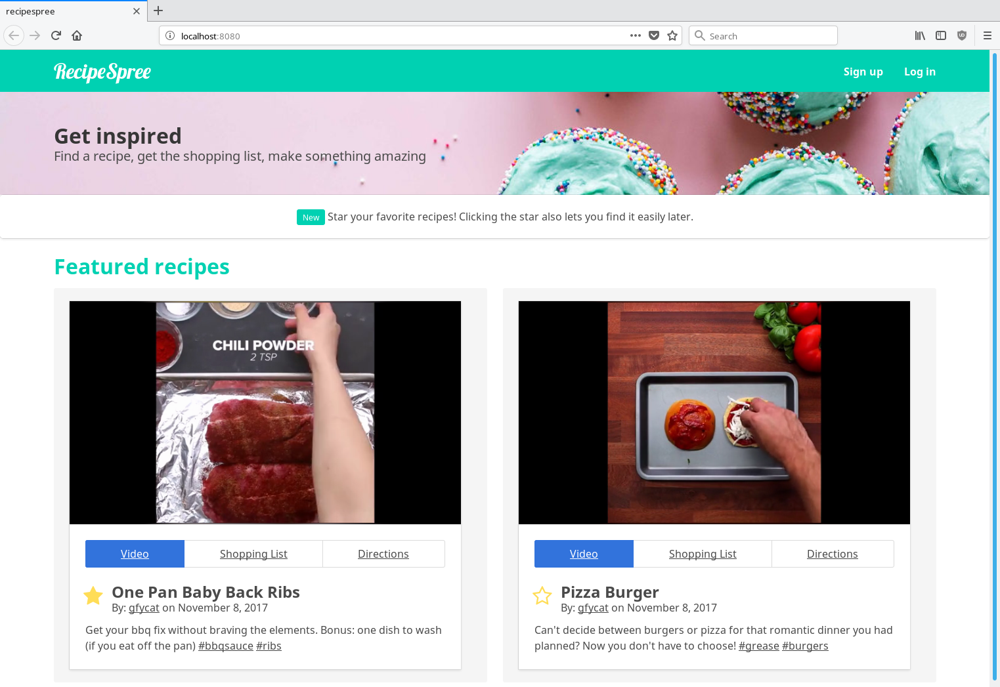

# recipespree

> A gif recipe site

Demo site for an idea.

Populated with dummy data (but in an object format that can support data fetched from an API).

Shopping list and directions tabs are just for demo/display purposes (no functionality)

Display of recipe tiles would need better logic to support more recipes (i.e. display rows of recipes in slices of two or three and use pagination to limit number of recipes loaded at once).

Made with Vue.JS and Bulma



## Build Setup

``` bash
# install dependencies
npm install

# serve with hot reload at localhost:8080
npm run dev
```
